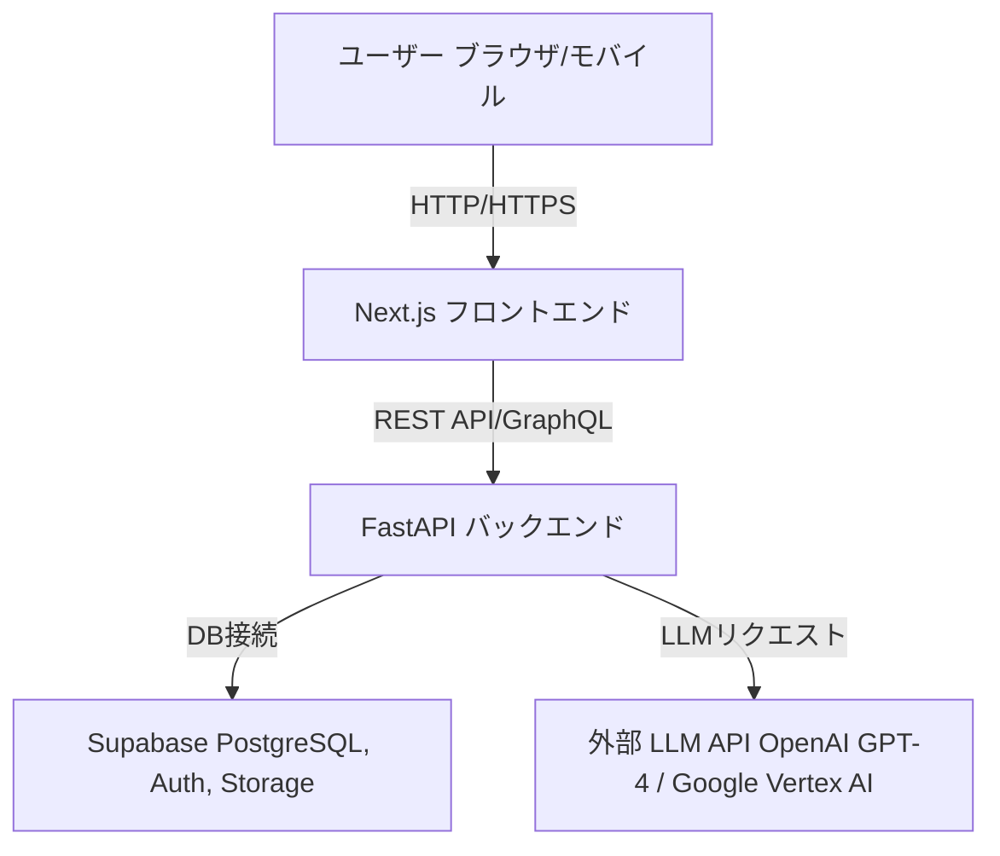
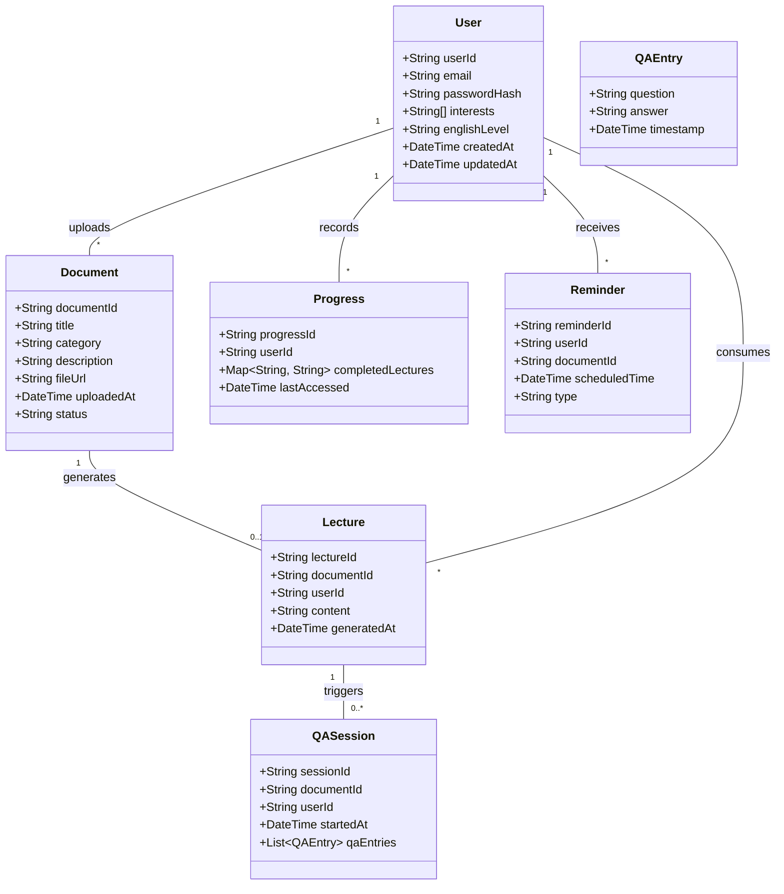

# Interactive Learning Platform Design Document

## 1. 概要 (Overview)

### 1.1 プロジェクト背景
- **目的:**
  英語が母国語ではない学習者向けに、ウェブ記事や技術書（PDF）をインポートし、AI が自動で講義生成と対話型 Q&A を実施することで、効率的な学習体験を提供する。

### 1.2 サービスの価値
- 学びのスピードの向上
- 英語の難解な文章をインタラクティブな会話で分かりやすく解説
- ユーザー自身が学びたい教材を自由にインポート可能
- 定期的な小テストと自動リマインドで学習継続をサポート

---

## 2. 要件とユースケース (Requirements & Use Cases)

### 2.1 機能要件
- ユーザー管理：アカウント作成、ログイン、プロフィール更新、進捗管理
- 教材管理：文書インポート、メタデータ抽出、文書一覧表示
- 学習支援：講義生成、対話型 Q&A、定期リマインド、小テスト生成

### 2.2 ユーザーストーリー
1. **ユーザー登録:**
   ユーザーは初回利用時にアカウントを作成し、興味のある技術分野や現在の英語レベルを入力する。

2. **文書インポート:**
   ユーザーが学びたいウェブ記事や技術書（PDF）をアップロードし、システムが自動でメタデータを抽出する。

3. **講義生成:**
   ユーザーが講義生成ボタンを押すと、システムがインポートされた文書の内容をもとに AI が講義形式に変換し表示する。

4. **対話型 Q&A:**
   ユーザーは講義や文書に基づいた質問を対話形式で行い、AI が回答する。

5. **進捗管理:**
   ユーザーの学習状況（完了した講義、QA セッション、テスト結果など）を記録し、次回学習のリマインドを実施する。

---

## 3. システムアーキテクチャ (System Architecture)

### 3.1 境界づけられたコンテキスト
1. **ユーザー管理コンテキスト:**
   - アカウント作成、プロフィール管理、学習進捗記録
2. **教材管理コンテキスト:**
   - 文書インポート、解析、メタデータ登録
3. **学習支援コンテキスト:**
   - 講義生成、対話型 Q&A、定期リマインド・小テスト生成

### 3.2 高レベル構成図

---

## 4. 技術スタック (Technology Stack)

- **フロントエンド:** Next.js (Reactベース)
  - ホスティング: Vercel
- **バックエンド:** FastAPI (Python)
  - コンテナ化: Docker
  - ホスティング: Google Cloud Run / Heroku / AWS Fargate
- **データベース・認証:** Supabase (PostgreSQL, Auth, Storage)
- **AI 連携:** 外部 LLM API (OpenAI GPT-4、または Google Vertex AI)
- **CI/CD:** GitHub Actions、Vercel の自動デプロイ、Cloud Build など

---

## 5. API 仕様 (API Specifications)

### 5.1 ユーザー管理 API
- **ユーザー登録:** `POST /api/users/register`
- **ログイン:** `POST /api/users/login`
- **プロフィール取得/更新:** `GET/PUT /api/users/profile`

### 5.2 教材管理 API
- **文書インポート:** `POST /api/documents`
- **文書一覧取得:** `GET /api/documents`

### 5.3 学習支援 API
- **講義生成:** `POST /api/lectures/generate`
- **対話型 Q&A セッション開始:** `POST /api/qa/start`
- **質問投稿:** `POST /api/qa/{sessionId}/question`

### 5.4 進捗管理 API
- **進捗取得:** `GET /api/progress`
- **進捗更新:** `POST /api/progress/update`

### 5.5 リマインド・小テスト API
- **リマインド取得:** `GET /api/reminders`

_※ 各エンドポイントの詳細なリクエスト/レスポンス例は、別途 Swagger/OpenAPI 仕様書にまとめる。_

---

## 6. データモデル (Data Model)

### 6.1 エンティティ概要
- **User:** ユーザー情報（ユーザーID、メール、パスワードハッシュ、興味、英語レベル、作成日時など）
- **Document:** インポートされた文書（文書ID、タイトル、カテゴリー、ファイル URL、アップロード日時、ステータス）
- **Lecture:** 講義内容（講義ID、関連文書ID、ユーザーID、生成された講義内容、生成日時）
- **QASession & QAEntry:** Q&A セッションと個々の質問/回答の記録
- **Progress:** 学習進捗情報（完了した講義、最終アクセス日時など）
- **Reminder:** リマインド・小テスト情報（リマインドID、ユーザーID、文書ID、予定日時、タイプ）

### 6.2 クラス図例

---

## 7. 実装計画とタスク分解 (Implementation Plan & Task Breakdown)

### 7.1 MVP の機能セット
- **ユーザー管理:** ユーザー登録、ログイン、プロフィール管理、進捗記録
- **教材管理:** 文書インポート、メタデータ抽出、文書一覧表示
- **学習支援:** 講義生成、対話型 Q&A、リマインド／小テスト生成

### 7.2 タスク例 (詳細はスプリント計画参照)
- ユーザー管理 API 実装、フロントエンド連携
- 文書インポート機能の実装、Supabase Storage 連携
- 講義生成 API の実装、外部 LLM API 連携
- Q&A セッション機能の実装、対話 UI の作成
- 学習進捗管理、リマインド／小テスト機能の実装
- CI/CD パイプラインの構築、デプロイメント設定

### 7.3 スプリント計画
- **スプリント 1:** ユーザー管理機能と環境セットアップ
- **スプリント 2:** 文書インポートと一覧表示
- **スプリント 3:** 講義生成機能（LLM 連携）
- **スプリント 4:** Q&A セッションと対話 UI の実装
- **スプリント 5:** 進捗管理とリマインド／小テスト機能の実装
- **スプリント 6:** 統合テスト、バグ修正、内部ベータテスト

---

## 8. デプロイメント戦略と運用 (Deployment & Operations)

- **フロントエンド:** Next.js アプリは Vercel でホスティング
- **バックエンド:** FastAPI アプリは Docker 化し、Google Cloud Run などで運用
- **データベース・認証:** Supabase を利用してマネージドサービスとして運用
- **CI/CD:** GitHub Actions と Vercel/Cloud Build を活用し、自動ビルド・デプロイ
- **監視:** ロギング、エラートラッキング、パフォーマンス監視（Cloud Logging、Sentry 等）

---

## 9. セキュリティとスケーラビリティ (Security & Scalability)

- **セキュリティ:**
  - HTTPS を強制、認証と認可は Supabase Auth 及び FastAPI 内で実装
  - API キー、シークレット管理は各クラウドプロバイダーの Secret Manager を使用

- **スケーラビリティ:**
  - サーバーレス環境（Cloud Run、Vercel）を利用し、トラフィックに応じた自動スケーリングを実現
  - キャッシュ戦略、コンテナのリソース管理、分散トレーシングの実装を検討

---

## 10. 結論と今後の展望 (Conclusion & Future Work)

本設計は、スモールスタートから始めてユーザーフィードバックを受け、段階的に機能追加・サービス拡張していくことを前提としています。
今後、実装フェーズでの検証を経て、必要に応じた改善やマイクロサービスへの分割を検討する予定です。

---

# 付録

- **用語集:**
  - **MVP:** Minimum Viable Product
  - **LLM:** Large Language Model
  - **Supabase:** オープンソースのバックエンド・アズ・ア・サービス

- **参考資料:**
  - API 仕様の詳細は別途 Swagger/OpenAPI ドキュメントを参照
  - 各コンテキストの設計詳細は内部 Wiki で共有

---